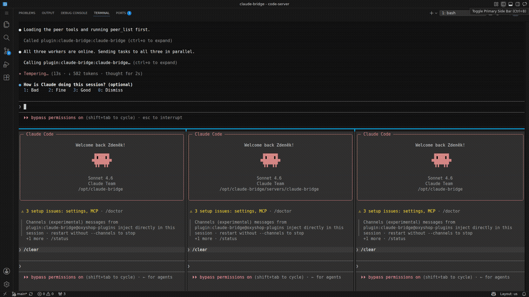

# claude-bridge

🇬🇧 English · 🇨🇿 [Česky](README.cs.md)

> Multi-chat orchestration for Claude Code. Two or more chats can talk to each other and look into each other's history. No copy-paste between windows, no server, no API keys — everything goes through the local filesystem.

[](https://github.com/michalekz/claude-bridge/releases/latest)

<sub>▶ **[Watch the full demo](https://github.com/michalekz/claude-bridge/releases/latest)** — one manager fans tasks out to three workers in a single **VS Code** window, they reply in real time, and you can read or search across every chat.</sub>

Built by [Zed Michalek](https://github.com/michalekz) at [oXyShop](https://oxyshop.cz). MIT licensed.

**Built for the multi-chat workflow in VS Code** — keep several Claude Code chats open side by side in the integrated terminal and let them coordinate. It works just as well from the plain `claude` terminal; a few characteristics differ between the two — see [CLI vs VS Code](docs/INSTALL.md#cli-vs-vs-code-extension) in the install guide.

## Why this exists

If you keep two or more Claude Code chats open side by side in VS Code, you eventually hit the same friction: one chat is working on something the other already knows, or needs to ask it a question. Today the answer is usually "copy the message from one window into the other". Or you ask Claude to figure the same thing out twice.

`claude-bridge` changes that. Chats can message each other, read what the next-door chat is currently working on, or search across every transcript on the machine.

## What the plugin actually adds

After installation, each chat gets a set of new MCP tools opening four categories of workflow:

**See other chats.** `peer_list` shows every active Claude Code chat on the same machine — its name, sessionId, cwd, age of last activity. A coordinating chat learns who is available.

**Send a message.** `peer_ask` writes a message into another chat's inbox; `peer_reply` answers a previously received message. Delivery is reliable even when the target chat is idle — the message waits in its inbox and arrives on the chat's next activity (or in real time, if the push channel is enabled).

**Read another chat's content.** `peer_chat_read` returns a sister chat's transcript — the last few messages, everything since its most recent user prompt, or messages matching a query (substring or regex). Supporting tools `list_projects`, `list_sessions`, and `session_stats` expose JSONL history metadata across all your projects.

**Search across chats.** `peer_chat_search` looks for arbitrary text across every session in the current project (default) or every project on the machine. Useful when you don't remember which chat discussed something but know the topic.

## When it's useful

The situations where the plugin pays off most:

**Two agents disagreeing on something.** A coordinator chat dispatches tasks to worker chats, listens to their answers, and routes the next step. One user, three chats running in parallel.

**You need context that lives in the neighbouring window.** "Hey, tell me what you and the other agent figured out about agent teams." Instead of switching tabs and re-reading backlog, chat A pulls the relevant section directly from chat B.

**Finding when a decision was made.** `peer_chat_read` with `query` finds the place where a specific topic was discussed, with surrounding context. `peer_chat_search` does the same across many sessions when you don't know where to look.

**Auditing what agents did overnight.** Read-only access to JSONL history lets you walk through next morning's standup — what was assigned, how it evolved.

## A few first examples

### Who is available

```
peer_list
```

Returns a list of active chats. Each has an `id` (UUID, always unique) and a `name` (human-readable slug; may collide if two chats share an ai-title).

### Message a sister chat

```jsonc
peer_ask {
  "to": "explore-mcp-server",
  "content": "Find every mention of agent teams in our history and summarize."
}
```

The target chat sees it either immediately (with push channel enabled — see INSTALL) or on its next MCP tool call (piggyback fallback — always reliable, just with a small latency).

### See what another chat is doing right now

```jsonc
peer_chat_read {
  "to": "explore-mcp-server",
  "sinceLastUserPrompt": true
}
```

Returns the sister chat's most recent user prompt plus everything the agent has produced since. Better than guessing `lastN`.

### Find a specific mention in one chat

```jsonc
peer_chat_read {
  "to": "explore-mcp-server",
  "query": "agent teams",
  "contextLines": 1
}
```

Finds every message containing "agent teams" (case-insensitive) plus one neighbour message before and after for context. Add `"queryRegex": true` for pattern matching.

### Search across the whole project

```jsonc
peer_chat_search {
  "query": "agent teams",
  "contextLines": 1
}
```

Returns matches from every chat in the current project. Default skips sessions older than 30 days.

### Search across every project

```jsonc
peer_chat_search {
  "query": "auth decision",
  "scope": "all-projects"
}
```

Scans every chat under `~/.claude/projects/`. If the filtered scope exceeds 200 MB, returns `scope_too_large` with a hint to narrow the query.

### Read a closed session that's no longer in the UI

```jsonc
peer_chat_read {
  "to": "09de67fe-2b3b-45d1-a576-aec89ffaf8c7",
  "crossProject": true,
  "lastN": 20
}
```

Works against any JSONL session in any of your projects — `crossProject: true` lifts the active-peer requirement.

## Things to keep in mind

The plugin runs **locally, on one machine**. Inbox traffic goes through the local filesystem, not over the network. Not yet suitable for distributed teams across machines.

**Real-time push requires admin enablement.** Channels (push notifications) are gated off at the organization-policy level by default. Without them the plugin works in piggyback-fallback mode — messages are delivered on the target chat's next tool call. For reactive workflow the admin needs to set `channelsEnabled: true` **and** add the plugin to `allowedChannelPlugins`. See [INSTALL](docs/INSTALL.md#real-time-push--why-and-how) for the full setup.

**VS Code Extension has lazy tab activation.** After window reload, the MCP server inside a chat tab only starts after you click the tab. Until then, that chat isn't visible in `peer_list`. The terminal CLI doesn't have this limitation — the chat is visible immediately.

**Search is fast on a dev box, slower on a notebook with many projects.** With ~5–15 projects and <50 MB total, `peer_chat_search` answers in 1–2 seconds. On a notebook with 50+ projects, `scope: 'all-projects'` may return `scope_too_large` (>200 MB). An FTS5 backend for very large scopes is planned for a future release.

## Documentation

- **[Installation and configuration](docs/INSTALL.md)** — installation via marketplace, channels setup (two independent gates), CLI vs VS Code Extension comparison, cross-platform shell snippets, troubleshooting.
- **[Detailed usage guide](docs/USAGE.md)** — every tool with arguments, examples, output formats, and workflow recipes.
- **[Changelog](CHANGELOG.md)** — release history.
- **[Security and privacy](SECURITY.md)** — what the plugin reads, what it writes, vulnerability disclosure.
- **[Credits](CREDITS.md)** — open source projects whose patterns shaped this one.

## Credits

`claude-bridge` borrows specific patterns from earlier open-source explorations of Claude Code cross-chat coordination:
[cc2cc](https://github.com/non4me/cc2cc) (atomic write + piggyback),
[claude-peers-mcp](https://github.com/louislva/claude-peers-mcp) (push channel),
[claude-relay](https://github.com/innestic/claude-relay) (factory closure pattern),
[multiclaude](https://github.com/dlorenc/multiclaude) (phase planning).
Full attribution and design notes in [CREDITS.md](CREDITS.md).

## License

MIT — see [LICENSE](LICENSE).
