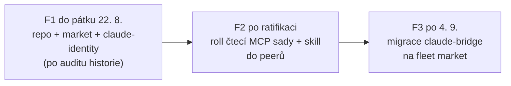

# Flotilový plugin market — návrh

Peeři se o nástroji identity nedozvědí, dokud není plugin s marketem
a skillem (Zdeněk, 17. 8.). Tento návrh říká KDE market vznikne, CO
v něm bude kdy, a jak se to snese s freeze 25. 8. – 4. 9.

## Evidence (přeměřeno 17. 8., ne z paměti)

| co | stav |
|---|---|
| git.oxyshop.cz | ŽIVÝ; repo `ai-tools/oxyshop-claude-plugins` = firemní market, aktivně vyvíjený cizíma rukama (5 pluginů; claude-bridge tam visí jako github-ref v0.6.1, ~30 verzí pozadu) |
| HTTPS glpat token | MRTVÝ (401, expirace ~9. 8.); zapečený v `known_marketplaces.json` a origin URL klonu ⇒ marketplace klon zamrzl 26. 5. |
| SSH | ŽIVÉ — `Welcome to GitLab, @michalekz`; ls-remote i fetch OK; push a právo založit projekt NEOVĚŘENO (netestováno zápisem) |
| repo claude-identity | bez remote; sken stromu na tokeny čistý; historie ~20 commitů k auditu |

## Rozhodnutí k ratifikaci

### R1 — NOVÝ repozitář, ne zařazení do firemního marketu

`git.oxyshop.cz/ai-tools/fleet-plugins` (jméno k odsouhlasení).

- Firemní market má vlastní kadenci a vlastníky (jira-mcp žene
  plt-plugin-dev); flotila potřebuje dev tempo.
- Identifikátorový kánon: `<plugin>@<marketplace>` musí být identický
  napříč instalací, allowlistem i `--channels`. MIGRACE claude-bridge
  = změna identifikátoru u ~24 peerů = změna distribučního kanálu,
  která před freeze nepatří.
- `claude-identity` je NOVÝ plugin bez existujícího identifikátoru
  → může na nový market hned, bez rizika.

### R2 — fáze

- **F1**: založit repo (Zdeněk GUI, nebo moje SSH — právo neověřeno) ·
  secrets audit VČETNĚ historie · push claude-identity · marketplace.json
  s jedním pluginem · úklid mrtvého tokenu (known_marketplaces + klon
  → SSH URL).
- **F2**: `/plugin marketplace add git@git.oxyshop.cz:ai-tools/fleet-plugins.git`
  + `/plugin install claude-identity@fleet-plugins` per peer; instalace
  se vyzvedává restartem peera (mechanismus známý z bridge marketplace).
  Peeři dostanou JEN čtecí sadu (Zdeněk rozhodl (a)): identity_list /
  identity_status / identity_whoami — `identity_switch` z MCP manifestu
  pro peery VEN; switch drží CLI + strážce (mechanismus, ne instrukce).
- **F3**: claude-bridge do fleet marketu až po freeze — koordinovaná
  změna identifikátoru u všech peerů (allowlist + --channels + update).

### R3 — skill (playbook pro peery, F2)

- `status` před velkou dávkou práce (rezerva všech identit jedním voláním).
- `whoami` při nejistotě, pod kým teču (otisk rozhoduje, ne jméno souboru).
- Pravidla switche: peer NEPŘEPÍNÁ — přepíná vlastník (CLI) nebo strážce;
  stand-by zprávy strážce = čekej, „obnoveno" tě probudí.

## ✅ F1 AUDIT HISTORIE PROVEDEN (17. 8. ~17:20) — ČISTÝ

- 29 commitů, VŠECHNY revize skenovány (`git grep` přes `rev-list --all`).
- Vzory tokenů (sk-ant/glpat/oauth2:/PRIVATE-TOKEN/ANTHROPIC_API_KEY=):
  1 unikátní zásah = maskovaný prefix `sk-ant-api03-r…` (14 znaků ze 108)
  v pilotním logu — sankcionovaná forma „logovat prefix", ne únik.
- `Bearer`/`claudeAiOauth`: jen zdrojový kód (probe/registry/switch) —
  čtení klíčů, žádné hodnoty.
- Entropie 60+ znaků: jen npm `integrity` sha512 (veřejné checksumy).
- Force-added soubory: 1 (pilot log) — prohlédnut řádek po řádku kolem
  „token/bearer/klíč": jen mody souborů, prefix, verdikty prózou.
- V evidenci jsou vlastníkovy e-maily a org id — nejsou to přihlašovací
  údaje; repo je interní (ai-tools skupina). Ponecháno vědomě.
- ⇒ Přepis dějin NENÍ potřeba. Push dál čeká na: uzavření strážce
  (G8/G9 + report designera) — podmínka ② designera.
- Repo `ai-tools/fleet-plugins` ZALOŽENO Zdeňkem (GUI) 17. 8. — otevřené
  body 1+2 uzavřeny; založení = jeho GO k publikaci tam.

## Bezpečnost push (F1 brána)

- Registr tokeny NEKOPÍRUJE by-design (čte ~/.claude-bridge/control/accounts).
- Audit před pushem: strom (hotovo, čistý) + VŠECHNY commity historie
  + force-added evidence logy (nesou jen otisky/prefixy, ověřit znovu).
- Soubor `.mcp.json` a manifest bez jakýchkoli hodnot; `identities.json`
  overlay je runtime soubor mimo repo.

## Otevřené body

1. Jméno repa: `ai-tools/fleet-plugins` (návrh) — potvrdit.
2. Založení repa: Zdeněk GUI × zkusit SSH/API právo @michalekz.
3. Kanál updatů: main = dev flotily (stable kanál až s claude-bridge F3).
