# Plán v3

Verzování sdílené se zadáním. Každý krok má bránu MĚŘITELNOU předem — test, který
umí selhat. Pořadí je závazné; krok se nezačíná před bránou předchozího.

## Přehled

```mermaid
flowchart LR
    R[R: inventura] --> D[D: demolice]
    D --> B1[B1: knihovna+registr]
    B1 --> B2[B2: fleet status+reconcile]
    B2 --> B3[B3: dispatch/stop/respawn]
    B3 --> B4[B4: kokpit+hlídač]
    B4 --> B5[B5: compact automat+hooky]
    B5 --> B6[B6: MCP+skilly+kanárek]
    B6 --> P0b[P0b: pilot 2]
    P0b --> P2[P2: migrace]
    P2 --> P3[P3: úklid]
```

## R: Inventura (0,5–1 den)

- Projít úplný povrch: oba servery, shared, skilly, hooky, šablony, testy, docs.
- Katalog `docs/cs/inventura-stary-svet.md`: každá položka právě jeden verdikt
  (PONECHAT / PONECHAT-jako-knihovnu / UPRAVIT / VYHODIT / ROZHODNOUT-Zdeněk).
- **Brána: ratifikace katalogu Zdeňkem.** Žádný zásah do kódu.

## D: Demolice (0,5 dne)

- tag `pred-prestavbou` na develop · větev `v012-novy-svet` · bump 0.12.0-alpha.
- Jeden čistě odebírající commit == sloupec VYHODIT, 1:1.
- **Brána: designer mechanická kontrola proti katalogu + tsc/biome/testy zbylého
  povrchu zelené (zprávová rovina MCP kompletně).**

## B1: Knihovna + registr (1 den)

- Sdílená knihovna z PONECHAT-jako-knihovnu: events, inbox zápis, čtení JSONL,
  čtení roster/jobs s pid+procStart verifikací.
- Formát registru rolí + parser + validace (kolize deklarací, neznámé klíče KŘIČÍ).
- Testy: čistě jednotkové (fixtury z reálných state.json z pilotu P0).
- **Brána: registr celé dnešní flotily (24 rolí) se validně zapíše a načte.**

## B2: fleet status + reconcile (1–2 dny)

- Smiřovač jako čistá funkce + `fleet status [--json] [--all]` + `fleet reconcile [--dry-run]`.
- Zámky: flock registru; per-role zámek (infrastruktura pro B3/B5).
- Testy: jednotkové (všechny stavy slotů ✅💀🕳👻⚠∅ z fixtur) + lab tmux
  (izolovaný socket, vzor tests/lab z P0: remain-on-exit, kotvy, respawn-pane).
- **Brána: status nad ŽIVÝM strojem správně klasifikuje dnešní smíšený stav
  (interaktivní peeři + jobs archiv) bez jediného zásahu; --dry-run reconcile
  vypíše akce a nic neudělá.**

## B3: dispatch / stop / respawn (1–2 dny)

- Preflighty, ready-check (state.json + první terminál + kanálový roundtrip),
  atomický stop s deregistrací, respawn s odmítnutím stopnuté role.
- Exit kódy dle kontraktu; `--dry-run`; audit události.
- Testy: lab (scratch role na izolovaném socketu, haiku) — každý exit kód
  vyvolán doopravdy, včetně preflight odmítnutí (duplicitní jméno — vzor T10).
- **Brána: dispatch→stop→dispatch→respawn cyklus na scratch roli, každý přechod
  doložen z evidence, žádný osiřelý záznam po úklidu.**

## B4: Kokpit + hlídač (1 den)

- Projekce: fleet socket config (base-index 1, renumber OFF, remain-on-exit ON),
  otevírání pohledů s kotvami, respawn-pane do mrtvého panelu.
- Démon-hlídač: inotify + tmux hooky + tick → `exec fleet reconcile`;
  systemd unit (recyklace šablony, OOM drop-in).
- Testy: lab — zabít pohled/respawn worker/stop a nechat hlídače konvergovat;
  změřit dobu konvergence.
- **Brána: kokpit scratch rodiny se z NULY postaví z registru jedním reconcile;
  po kill-window i po respawnu konverguje do 30 s bez lidského zásahu.**

## B5: Compact automat + hooky (1–2 dny)

- `fleet compact` dle §7: journal, predikáty z JSONL, timeouty, eskalace kanálem,
  wake primárně kanálem + záložní injekt.
- Hooky: PreCompact auto (exit 2 bez kotvy) + manual (stdout) + SessionStart
  compact + PreToolUse Bash deny-filtr. Distribuce pluginem.
- **Brána = DŮKAZY VÝSTŘELU, každý zvlášť:** ① autocompact bez kotvy zablokován
  naostro ② řízený compact potvrzen z JSONL ③ kanálový wake vyvolal tah
  ④ zabití operátora uprostřed → reconcile dokončil/eskaloval ⑤ PreToolUse
  deny na signál claude pidu ⑥ eskalace každého timeoutu doručena kanálem.

## B6: MCP + skilly + kanárek (1 den)

- 6 MCP nástrojů jako exec wrappery; popisy psané znovu (včetně negativ).
- Skilly `fleet-vedeni`, `fleet-diagnostika`, runbook migrace.
- `fleet canary` + zapojení do rollu; pravidlo retence `jobs/`.
- **Brána: nástroje volatelné z peera (scratch), popisy zrevidované designerem,
  kanárek FAIL vyvolán uměle a alarm doručen.**

## P0b: Pilot 2 (2–3 dny běhu, scratch tým 3 role)

Ověřuje §12 zadání + **předpovědi z oponentury v3** (námitky se nezapracovávají,
překládají se sem jako testy s předem napsaným očekáváním):

| test | otázka |
|---|---|
| remain-on-exit + respawn-pane | drží slot přes stop/respawn/binárku? |
| pinning z CLI | zabrání idle-reapu (65 min)? |
| /bg migrace (T7) | přenese kontext + MCP + channels? |
| SessionStart hook v bg | #60112 — pády? |
| kanálový wake po skutečném compactu | vyvolá tah? za jak dlouho? |
| journal-resume | kill -9 operátora v každém stavu automatu |
| RSS/spare, 3→20 extrapolace | práh +4 GiB drží? |
| restart stroje | JEN při plánovaném rebootu |

**Brána: všechna měření hotová, žádný ztracený vstup, verdikt nad každou
námitkou oponentury (potvrzena měřením / vyvrácena měřením).**

## P2: Migrace (tým po týmu, dny)

- Runbook: /bg → registrace → pohled → checklist (channels roundtrip, MCP,
  kontext, jméno) → inverzní krok definován.
- Pořadí: scratch → etl (2) → ai → plt → mic; velitelé poslední; po týmu 48 h klidu.
- **Brána každého týmu: checklist 100 % + 48 h bez incidentu třídy „ztracený vstup".**

## P3: Úklid (0,5 dne)

- Stará MCP jména pryč najednou; dokumentace (USAGE/INSTALL/architecture);
  postup návratu k `pred-prestavbou` sepsán a jednou vyzkoušen nanečisto (build
  z tagu, bez nasazení); merge do develop.
- **Brána: flotila celá na nové cestě, dokumentace odpovídá povrchu (kánon #84).**

## Souhrn odhadu

R+D ~1,5 dne · B1–B6 ~6–9 dní · P0b 2–3 dny běhu · P2 dle týmů · P3 0,5 dne.
Rizika a mitigace: viz zadání §10; práh zdrojů a alarmy platí od P0b.
