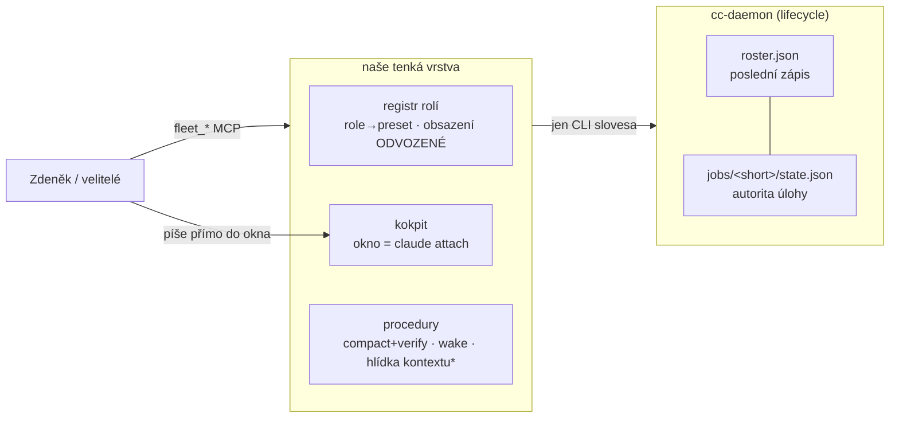

# Zadání v2: flotila nad cc-daemonem

Lifecycle peerů přebírá cc-daemon Claude Code; my stavíme registr rolí, kokpit
a procedury. Principy ratifikace (16. 8.) platí beze změny: **tenká vrstva ·
pryč se starým světem · od nuly z pohledu cc-daemonu.** Tvrdá omezení trvají:
subscription billing · vlastník kdykoli píše do okna peera · 20 peerů není problém.

V2 se od v1 liší tím, že **každé sporné tvrzení prošlo pilotem** — 9 testů na
živém cc-daemonu, křížených s dokumentací a changelogem.

## Delta proti v1 (co pilot a oponentura změnily)

| # | v1 tvrdilo / oponent žádal | pilot změřil | v2 |
|---|---|---|---|
| D1 | oponenti: „keeper supervizoru pod systemd" (BLOKUJE) | T1+T8: kill -9 supervizoru → **pohledy ho oživí** (≤90 s, podruhé <1 s), workeři přežijí | keeper ŠKRTNUT; boot flotily = naše dispatch procedura; jen alarm „supervizor se točí" |
| D2 | expert: „výměna binárky = fleet-wide riziko" (BLOKUJE) | T2: touch → self-restart „upgrade", adopted=2 dead=0, ~15 s | riziko zúženo na průnik „EACCES ∧ žádný klient"; řešení = kanárek s obsahem, NE zákaz auto-update |
| D3 | v1: „terminální stav ⇒ žádné vzkříšení" jako pilíř | T3: stav píše klasifikátor per tah („hotovo"→blocked, „rozluč se"→done) · T4c: **attach stopnutou session OŽIVÍ** | lifecycle logika VÝHRADNĚ na `stopped` + neexistenci procesu; `done/failed/blocked` jsou popisky nálady, ne stavy života; stop není hrob |
| D4 | v1: `fleet_stop` = `claude stop` | T4: pohled umírá se stopem sám; oživení attachem trvá | `fleet_stop` = atomicky stop + deregistrace obsazení (pohled zaniká sám); vědomé oživení = nový `fleet_dispatch` |
| D5 | v1: `fleet_status` = `agents --json` + state.json | T4b: bez `--all` zastavené NEVIDĚT · T9: živost = pid+procStart proti /proc (levné, funguje) · T8: CLI side-efekty malé | files-first, CLI s `--all`, živost vždy ověřená; roster = poslední zápis, ne pravda |
| D6 | v1: kolize jmen „detekovat a hlásit" | T10: duplicitní jméno projde bez varování | `fleet_dispatch` dostává PREFLIGHT (živě ověřené obsazení), detekce v status zůstává |
| D7 | v1: `CLAUDE_CODE_DISABLE_AGENT_VIEW` „nedokumentovaná" | expert: JE dokumentovaná (settings `disableAgentView`); pro attach klienty existuje `leftArrowOpensAgents` | mitigace přes settings; env jen kde settings nejde |
| D8 | v1: sedm nástrojů | skeptik + pilot | **pět**: dispatch · stop · respawn · status · view-open (+ `peer_compact` beze změny); `view close/move` škrtnuty (close dělá stop sám — T4a; move bez doloženého incidentu); `peer_migrate` = runbook |
| D9 | v1: „žádost vždy přes naši vrstvu (audit, serializace, brány)" | skeptik: serializace = doložená vada #82; rozpor s „ruční pákou" | obsazení registru je ODVOZENÉ smířením, ne autorita; audit jen u dispatch/stop; plošná serializace škrtnuta |
| D10 | v1: „hlídky kontextu a limitů" | skeptik: hlídka limitů koliduje s ratifikací rotace (9. 8.) | jen hlídka KONTEXTU, výhradně s důkazem výstřelu v akceptaci |
| D11 | v1 neznalo | kb-ops: `jobs/` bez retence na disku 90 %; `intent` = nesmazatelná stopa vstupu (přenáší se každým přepisem, doloženo mtime) | retence + klasifikace evidence jako JEDNO pravidlo, platí od P1, ne od P3 |
| D12 | v1 neznalo | kb-ops: osiřelý netermální záznam drží jméno (mechanika ranní kolize) | registr zná třetí stav „osiřelý" (záznam bez procesu); status ho hlásí zvlášť |
| D13 | v1 neznalo | provoz: žádný alarm žádné třídy; changelog: rasa stop×respawn, korupce rosteru | minimální alarmní cesta (channel zpráva vlastníkovi/veliteli) pro: kolize jmen, kanárek FAIL, osiřelé záznamy — nic víc |
| D14 | v1: kanárek „smoke test po každé výměně" | skeptik: táž smyčka to už jednou škrtla jako drahé; expert: nebezpečný je SELHAVŠÍ self-restart, ne úspěšný | levný kanárek (verze, přítomnost `disableAgentView`/sloves, ugrep vzor, věk shell snapshotů) + plný smoke jen před záměrným rollem |
| D15 | v1: TmuxDriver „nouzový návrat" vs P3 „smazat" (rozpor, kb-ops 8) | — | návrat = git značka `pred-prestavbou` + zdokumentovaný postup obnovy; strom se v P3 čistí |

## Co pilot POTVRDIL z v1 (beze změny)

- `--channels` u `--bg` funguje obousměrně (T6, `KANÁL-OK` ~4 s) — presety rolí projdou
- okna jako pohledy: 2 pohledy různé geometrie současně, odpojení nic nerozbije (T11)
- compact cc-daemon neumí, ne-interaktivní vstup neumí → **řízený compact a channels zůstávají naše**
- `respawn --all` = mechanismus rollu binárky (докazuje i self-upgrade v T2)

## Architektura (v2)

\* jen s důkazem výstřelu

### Registr rolí
- deklarace `role → preset` (cwd, model, `--channels`, permissions, `--autocompact`, tým, jméno dle konvence) — soubor v repu
- **obsazení (role → short) je odvozené smířením** registru s rosterem+jobs, ne autorita (D9)
- stavy obsazení: `obsazená` (živý proces, pid+procStart sedí) · `volná` · **`osiřelá`** (záznam bez procesu, D12)
- kolize jmen: preflight při dispatch (D6) + průběžná detekce ve status

### Kokpit
- `fleet_view open` — jediné sloveso; zavření dělá stop sám (T4a), přesun nemá doložený incident
- kontrola „okno zobrazuje peera" při otevření a na vyžádání, žádný poller
- pro attach klienty settings `leftArrowOpensAgents` (D7); interaktivní peeři staré cesty do migrace `disableAgentView`

### Procedury
- řízený compact s ověřením z JSONL (beze změny; dnes jen na vyžádání)
- wake po compactu (jediný injekt do panelu)
- hlídka kontextu: staví se JEN s důkazem výstřelu v akceptaci, jinak vůbec
- hlídka limitů: MIMO (patří rotaci, ratifikace 9. 8.)

## Nástroje (5 + compact)

| nástroj | tělo | klíčová sémantika z pilotu |
|---|---|---|
| `fleet_dispatch {role}` | preflight obsazení (živě!) → `claude --bg` s presetem → smíření → okno | jediná AUTOMATICKÁ cesta vzniku; ruční CLI zůstává legitimní — smíření ho do 1 cyklu vstřebá |
| `fleet_stop {role}` | `claude stop` + deregistrace obsazení atomicky | stop je vratný (attach oživí) — proto deregistrace patří dovnitř |
| `fleet_respawn {role\|tým}` | `claude respawn`, po jednom | chování nad `stopped` rolí: odmítne (respawn ≠ oživení; oživení = dispatch) |
| `fleet_status` | soubory-first (`jobs/*/state.json` + pid/procStart), CLI `--all` jen proti živému supervizoru | `state` zobrazovat jako „nálada" (T3), život jen z procesu; hlásí osiřelé + kolize + obě cesty během migrace |
| `fleet_view {role} open` | tmux okno s `claude attach <short>` | kontrola identity okna při otevření |
| `peer_compact` | beze změny | — |

Zásady: výhradně CLI povrch, `control.sock` nikdy · audit u dispatch/stop · žádná plošná serializace (#82).

## Evidence a provoz

- tabulka evidence: roster (poslední zápis) · `state.json` (autorita, `intent` = trvalá stopa vstupu) · `timeline.jsonl` (nedokumentované, jen ke čtení) · `exit-cause` · `attach-journal/` · `claude logs <id>` (diagnostika)
- **retence + klasifikace `jobs/`**: citlivá evidence, pravidlo retence od P1 (disk 90 %, D11)
- **kanárek binárky** (D14): levný — verze, `disableAgentView` v settings povrchu, ugrep reprodukční vzor, integrita respawnFlags, věk shell snapshotů vs binárky; plný smoke jen před rollem
- **alarmní minimum** (D13): kolize jmen · kanárek FAIL · osiřelý záznam → channel zpráva; nic dalšího
- práh zdrojů pro pilot/migraci: **+4 GiB RSS flotily proti dnešku = STOP** (návrh kb-ops, vyslovený předem)

## Otevřené otázky (zbytek P0 — měří se, nedrží P1)

1. idle-reap ~1 h peera bez okna + pinning z CLI (`pins.json`) — běží přes noc
2. dlouho připojený attach × `claude respawn` — ráno
3. `/bg` migrace interaktivního peera se vším (kontext, MCP, channels) — runbook vznikne z měření
4. restart stroje — při nejbližším plánovaném rebootu (neshazovat flotilu kvůli testu)
5. RSS/spare trend v čase — běží přes noc; SessionStart hook × bg sessions (issue #60112) hlídat v kanárku

## Fáze

| fáze | obsah | brána |
|---|---|---|
| P0 | ✅ z větší části hotov (9 testů); zbytek viz otevřené otázky | otázky 1–2 zodpovězeny |
| P1 | registr + 5 nástrojů + kokpit + kanárek + retence; TmuxDriver žije | testy + revize + důkaz výstřelu hlídky (pokud se staví) |
| P2 | migrace runbookem: scratch → etl → zbytek; velitelé poslední; status zobrazuje obě cesty | po každém týmu 48 h klidu |
| P3 | odstranění starého světa; značka `pred-prestavbou` + postup návratu; dokumentace | flotila kompletní na nové cestě |

Vlastnictví beze změny: kód bridge-dev · produkce kb-ops · GO Zdeněk.
