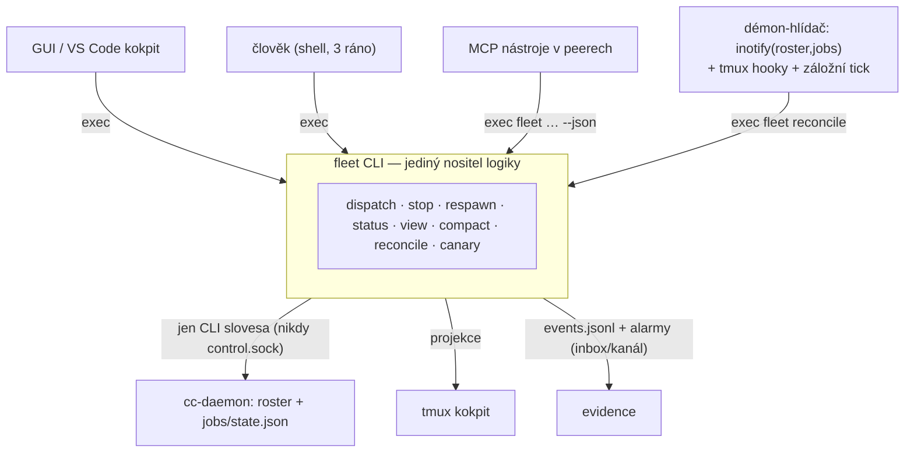
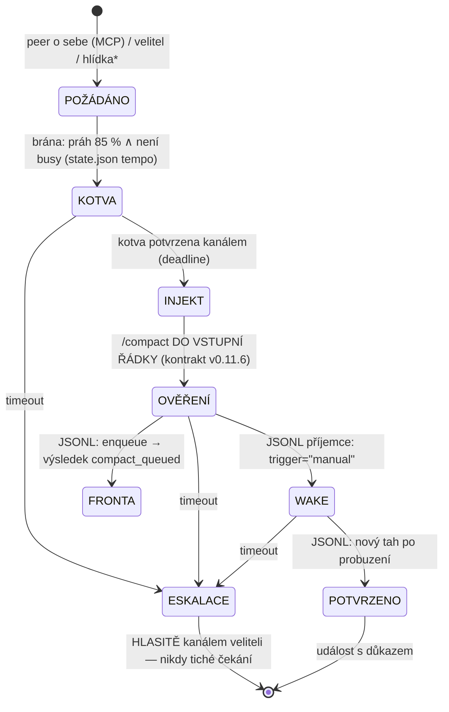

# Zadání v3: flotila nad cc-daemonem, logika ve fleet CLI

Lifecycle peerů vlastní cc-daemon Claude Code. Veškerá naše logika žije v **jednom
CLI nástroji `fleet`**; démon je jen hlídač, MCP jen překlad, GUI i člověk volají
totéž CLI. Ratifikované principy (16. 8.): **tenká vrstva · pryč se starým světem ·
od nuly z pohledu cc-daemonu.** Doplněné rozhodnutí (17. 8., D16): **logika do CLI.**

Tvrdá omezení trvají: subscription billing (žádné API/SDK) · vlastník kdykoli
píše do okna peera · 20 peerů na stroji není problém.

## Rozcestník

| sekce | obsah |
|---|---|
| §1 | architektura a role komponent |
| §2 | registr rolí a jména |
| §3 | kokpit (tmux) — sloty, kotvy, pořadí |
| §4 | smiřovač |
| §5 | fleet CLI — kontrakt |
| §6 | lifecycle operace |
| §7 | compact deterministicky |
| §8 | vynucování (hooky) |
| §9 | MCP povrch a skilly |
| §10 | binárka, evidence, alarmy, zdroje |
| §11 | demolice starého světa (git + provedení) |
| §12 | co je změřeno × co ověří pilot 2 |
| §13 | fáze a brány |

## §1 Architektura



- **Jedna cesta pro všechny volající** — preflighty, brány a audit nelze obejít,
  protože neexistuje druhá cesta (ruší rozpor „ruční páka × jediná cesta").
- **Žádná sdílená RPC smyčka** (pohřbívá změřenou vadu #82) — souběh řeší zámky
  podle zdroje: krátký `flock` nad registrem, zámek per-role pro dlouhé procedury.
  Neudělený zámek = čitelné odmítnutí, ne fronta.
- **Dlouhá procedura přežije smrt svého procesu**: stav v journalu (soubor),
  hlídačův `reconcile` je druhý vykonavatel téhož automatu — posune nebo eskaluje.
- Démon-hlídač: systemd unit (nese OOM drop-in a journal), pár set řádek, jediná
  akce `exec fleet reconcile`. Keeper supervizoru NENÍ (T1: pohledy ho oživí samy;
  boot flotily = `fleet dispatch`, supervizor naskočí sám).

## §2 Registr rolí a jména

- Soubor v repu (verzovaný, revidovatelný): `role → preset` (cwd, model,
  `--channels`, permissions, `--autocompact`, tým, jméno dle [[fleet-naming-convention]]).
- **Obsazení `role → short` je ODVOZENÉ smířením** (registr × roster × jobs), ne autorita.
- Stavy obsazení: `obsazená` (živý proces: pid+procStart proti /proc — T9) ·
  `volná` · `osiřelá` (záznam bez procesu — mechanika kolize z 16. 8.).
- **Jména se nikde neodvozují, všude zapisují:** dispatch `-n <plné-jméno>`
  (cc-daemon i bridge vidí totéž), tmux okno = krátké jméno, kotva `@role` = plné.
- **Automatika adresuje výhradně short/sessionId** — jména jsou pro lidi.
  Short i sessionId přežívají respawn (měřeno) ⇒ bridge směrování je vůči
  respawnu imunní.
- Preflight kolizí u dispatch (T10: duplicitní jméno projde bez varování);
  drift jmen (přejmenování Ctrl+R) detekuje smíření → alarm, neopravuje tiše.

## §3 Kokpit

Fleet tmux server (vlastní socket) se třemi volbami, ze kterých plyne stabilita
pořadí **konstrukcí, ne opravou**:

```
base-index 1 · renumber-windows OFF · remain-on-exit ON
```

- `renumber-windows OFF`: index okna = trvalá adresa slotu; zánik okna nechá
  informativní díru, ne posun (třída #103 zaniká).
- `remain-on-exit ON`: pohledy umírají při stopu (T4a), respawnu (T13) i výměně
  binárky (naostro 17. 8. 06:11) — mrtvý panel ale zůstane NA MÍSTĚ s kotvami
  a smiřovač dělá `respawn-pane -k` s novým attachem do téhož panelu. ⚠ ověří pilot 2.
- **Kotvy = tmux user options na panelu** (M1 změřeno): `@role` + `@short`.
  Náš zápis, proti kterému se `pane_title` jen kontroluje — title píše proces a umí lhát.
- Deklarace rodin: `rodina (tmux session) → okna (index → role | panely[pořadí])`.
- Okno = `claude attach <short>`; libovolně pohledů, různé geometrie OK (T11).
- Attach klienti: settings `leftArrowOpensAgents` off; interaktivní peeři staré
  cesty do migrace `disableAgentView` (obojí dokumentované).

## §4 Smiřovač

Čistá funkce `(registr, roster, jobs, tmux) → seznam akcí`; testovatelná bez
tmuxu i cc-daemonu. Jednosměrný tok: **registr a soubory cc-daemonu jsou pravda,
tmux je obnovitelná projekce** — kokpit lze kdykoli zbourat a postavit znovu.

| zjištění | akce |
|---|---|
| role má běžet, session není | ŽÁDNÝ auto-dispatch — alarm (vznik peera je rozhodnutí) |
| session žije, pohled mrtvý/chybí | `respawn-pane`/otevřít okno do slotu |
| okno žije, session ne / cizí obsah | zavřít/označit + alarm |
| osiřelý záznam · kolize jmen · drift jména | alarm kanálem |
| rozběhnutá procedura s prošlým stavem | posunout automat nebo eskalovat |

Spouštěče: inotify na `daemon/roster.json` + `jobs/` · tmux hook `pane-died`/
`window-unlinked` · na vyžádání (`status`, `dispatch`) · záložní tick ~5 min
(přiznaná pojistka). Žádný tichý poller obsahu panelů.

## §5 fleet CLI — kontrakt

```
fleet dispatch <role> [--rodina X]     fleet stop <role>        fleet respawn <role|--rodina X>
fleet status [--json] [--all]          fleet view open <role>   fleet compact <role>
fleet reconcile [--dry-run]            fleet canary
```

- `--json` výstup se schématem; exit kódy jako kontrakt (0 hotovo · 2 odmítnuto
  preflightem · 3 timeout/eskalováno · …); `--dry-run` u mutací.
- Výhradně dokumentovaná CLI slovesa cc-daemonu; `control.sock` nikdy.
- Audit: každá mutace zapisuje do `events.jsonl` (kdo/kdy/co/výsledek).
- Nasazení kopií do `~/.claude-bridge/bin/` (kánon: nasadit = zkopírovat).
- `fleet status --json` je zároveň datový zdroj pro GUI/VS Code kokpit (#58).

## §6 Lifecycle operace

```
dispatch: preflight (živé obsazení + kolize) → claude --bg -n … s presetem
          → čekej: state.json existuje + první tah terminální (čerstvý peer je hluchý, #108)
          → kanálový roundtrip ping → zapiš obsazení → otevři pohled → ověř kotvy
stop:     claude stop → ověř state=stopped → deregistruj obsazení ATOMICKY
          (T4c: attach umí stopnutou session oživit — proto deregistrace patří dovnitř)
respawn:  claude respawn → ověř nový pid+procStart → pane-died → respawn-pane attach
          nad stopnutou rolí: ODMÍTNI (oživení = vědomý dispatch)
rodina:   dispatch v deklarovaném pořadí, další až po ověřeném předchozím;
          stop pozpátku, velitel poslední; respawn po jednom — okna se nehýbou
```

Stavová sémantika (T3 změřeno): `done/failed/blocked` píše jazykový klasifikátor
podle formulace tahu — jsou to **popisky nálady**, ne stavy života. Život čte
výhradně z procesu (pid+procStart); jediný spolehlivý terminál je `stopped`.
Idle-reap: peer bez pohledu ztrácí proces za ~65 min (T5) → každá role má pohled,
nebo je pinovaná (pins.json — ověří pilot 2), nebo je reap vědomá volba presetu.

## §7 Compact deterministicky

Compact NIKDY nedělá peer — nemůže (`/compact` je UI příkaz). Slova peera nejsou
vstup automatu. Procedura `fleet compact <role>`:



- Každý stav: predikát z CIZÍ evidence (JSONL příjemce, state.json) + timeout
  + hlasitý konec. „Peer prohlásil compactuji se" nemá kam vést.
- **Wake dvěma nezávislými cestami, obě ověřené z JSONL:** primárně kanálová
  zpráva (pilot: idle bg peer se budí na peer_ask do vteřin), záložně injekt
  prosté řádky (pravidlo v0.11.25: pokračuje ⇔ má nevyzvednutý vstup).
- Stav procedury v journalu → přežije smrt operátora (§1); reconcile eskaluje.
- Většina článků NASAZENA (práh #107②, ověření z JSONL, compact_queued, doručení
  do vstupní řádky) — nové je: kanálový wake, timeouty s eskalací, busy z tempo.

## §8 Vynucování

Tři patra: **co musí platit → kód (CLI/hook) · kontrakt → popis nástroje ·
úsudek → skill.** Nic, co musí platit, nesmí bydlet jen v textu, který model čte.

| hook | úloha | důkaz třídy |
|---|---|---|
| `PreCompact` matcher `auto` | bez čerstvé kotvy exit 2 ⇒ autocompact SE NEKONÁ | měřeno 13. 8. (blokuje; `continue:false` neblokuje) |
| `PreCompact` matcher `manual` | stdout = pokyny pro souhrn (kotva, úkoly, adresy) | měřeno 13. 8. (souhrn začal markerem) |
| `SessionStart` matcher `compact` | additionalContext = re-onboard ukazatel | měřeno 13. 8. ⚠ #60112 (pády bg sessions v květnu) — důkaz na pilotu 2 |
| `PreToolUse` matcher `Bash` | deterministický deny: signály na claude pidy, zápis do `~/.claude/jobs\|daemon/`, `control.sock`, `send-keys` na fleet socket, `claude stop/respawn/rm` → „použij fleet_*"; šeď → LLM gate | vzor zavedený (LLM gates) |

- Hooky distribuuje plugin (verzované s ním); dispatch vlastní `respawnFlags`
  (žádné `--bare`); kanárek kontroluje přítomnost hooků.
- **Každý hook i hlídka se staví jen s důkazem výstřelu v akceptaci.**
- Hranice řečená nahlas: chrání proti přehmátnutí, ne proti záměru (ratifikováno).

## §9 MCP povrch a skilly

- **6 MCP nástrojů** = tenké `exec fleet … --json`: `fleet_dispatch/stop/respawn/
  status/view` + `peer_compact`. Démon mimo MCP cestu.
- Zprávová rovina beze změny (ask/reply/inbox/chat/context/guardy/rate_limit).
- Popisy nástrojů se píší ZNOVU, včetně negativ („stop je vratný", „respawn
  odmítne stopnutou") — popis je kontrakt pro 24 čtenářů-modelů.
- Skilly v pluginu: `fleet-vedeni` (sémantika stavů ✅💀🕳👻⚠∅, rozhodovací strom,
  „věta ‚compactuji se‘ je zakázaná — akt je volání nástroje") ·
  `fleet-diagnostika` (pořadí čtení: status → logs → state.json/exit-cause →
  daemon.log; co NEDĚLAT) · runbook migrace (dočasný).
- Kánon: skilly a popisy se mění ve stejném vydání jako povrch.

## §10 Binárka, evidence, alarmy, zdroje

- 🔴 **Flotila neběží z npm cesty** (17. 8. 06:11 naostro: reinstall → ENOENT
  self-respawn → mrtvý worker I pohledy; záchrana klienty potřebuje binárku,
  která v tom okně neexistuje). Dispatch, attach i supervizor z NAŠÍ KOPIE
  binárky na stabilní cestě; roll = řízená výměna kopie + `respawn --all` + kanárek.
- Kanárek (levný, průběžný): verze · přítomnost `disableAgentView` a sloves ·
  ugrep reprodukční vzor · integrita respawnFlags · věk shell snapshotů;
  plný smoke jen před rollem. Kanárek FAIL = alarm.
- Evidence: roster (poslední zápis) · state.json (autorita; `intent` = trvalá
  nezredigovaná stopa vstupu) · timeline.jsonl (nedokument., jen čtení) ·
  exit-cause · attach-journal · `claude logs`. **Retence + klasifikace `jobs/`
  jako citlivé evidence — pravidlo od P1** (disk 90 %).
- Alarmní minimum kanálem: kolize jmen · kanárek FAIL · osiřelý záznam ·
  eskalace procedur · „supervizor se točí". Nic víc.
- Práh zdrojů: **+4 GiB RSS flotily proti dnešku = STOP** (vysloveno předem).
- Hlídka limitů MIMO (patří rotaci, ratifikace 9. 8.).

## §11 Demolice starého světa

Jednorázově, ne po nástrojích (ratifikováno 17. 8.):

```
tag pred-prestavbou → větev v012-novy-svet (0.12.0-alpha)
C1 inventura + katalog (PONECHAT / PONECHAT-jako-knihovnu / UPRAVIT / VYHODIT /
   ROZHODNOUT)                                    [brána: ratifikace Zdeněk]
C2 DEMOLICE — jeden čistě odebírající commit == sloupec VYHODIT 1:1
   [brána: designer mechanická kontrola + zeleň zbylého povrchu (zprávová rovina celá)]
C3+ stavba dle plánu v3                            [brány per krok]
merge do develop až s bránou P1 · main/marketplace nedotčeno
```

Repozitář ≠ provoz: flotila jede na nasazeném v0.11.26 až do migrace. Během P2
jsou staří peeři bez nástrojové obsluhy (runbook + ruka) — vědomé rozhodnutí,
ne opomenutí; `fleet status` je vidí.

## §12 Změřeno × ověří pilot 2

**Změřeno (P0, 16.–17. 8.):** channels u `--bg` obousměrně (T6) · supervizor
oživen pohledy (T1, T8) · touch binárky šťastná cesta (T2) · reinstall
nešťastná cesta naostro (06:11) · stavy = klasifikátor (T3) · stop: pohled
umírá, výpis chce `--all`, attach oživí (T4) · idle-reap 65 min (T5) ·
pid+procStart (T9) · duplicitní jméno projde (T10) · dva pohledy (T11) ·
pohled NEPŘEŽIJE respawn (T13) · kotvy @role/@short (M1).

**Pilot 2 ověří (sem se překládají i námitky z oponentury v3 — nezapracovávají se):**
`remain-on-exit` + `respawn-pane` s attachem · pinning (pins.json) z CLI ·
`/bg` migrace se vším (T7) · SessionStart hook v bg sessions (#60112) ·
kanálový wake po skutečném compactu · journal-resume procedury po zabití
operátora · restart stroje (při plánovaném rebootu) · RSS/spare při 20 peerech.

## §13 Fáze a brány

| fáze | obsah | brána |
|---|---|---|
| R | inventura + katalog | ratifikace Zdeněk |
| D | demolice (1 commit) | designer 1:1 + zeleň zbytku |
| B | stavba dle plánu v3 | per krok; hooky/hlídky s důkazem výstřelu |
| P0b | pilot 2 (scratch tým) — otázky §12 + předpovědi oponentů | měření kompletní |
| P2 | migrace runbookem: scratch → etl → zbytek; velitelé poslední | 48 h klidu po týmu |
| P3 | úklid: stará jména MCP pryč najednou, dokumentace, `pred-prestavbou` postup návratu | flotila celá na nové cestě |

Vlastnictví: kód bridge-dev · commity designer · produkce kb-ops · GO Zdeněk.
