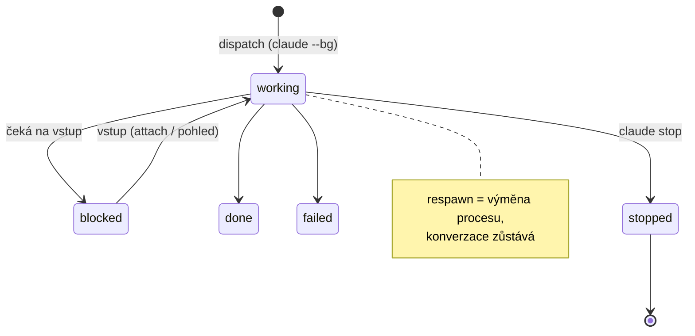

# Zadání: flotila nad cc-daemonem

Claude Code má vlastního démona pro správu sessions (`cc-daemon`): spouští, eviduje,
respawnuje a zastavuje je, a session přežívá pád svého okna. Náš démon dosud
tutéž práci dělal sám, vedle něj — dvě řídicí roviny nad týmiž procesy, které
o sobě nevěděly. Incidenty z 16. 8. (dvojí `mic-velitel`, vstup vlastníka
tekoucí do cizí konverzace, vzkříšení po SIGTERM) jsou důsledky toho souběhu.

Zadání otáčí směr: **lifecycle peerů přebírá cc-daemon, my stavíme jen to, co
záměrně neřeší.**

## Ratifikovaný rámec (Zdeněk, 16. 8.)

1. Z „control plane s vlastním lifecycle" se stává **tenká vrstva**.
2. **Pryč se starým světem** démona a navazujících nástrojů.
3. Celá orchestrace se staví **znovu od nuly, z pohledu cc-daemonu**.

Trvající tvrdá omezení (nezměněna):

- Běh se platí ze subscription Claude Code — žádné API/SDK/CMA.
- Vlastník musí mít možnost **kdykoliv přijít k oknu peera a napsat mu**.
- Dvacet peerů na stroji nesmí být problém.

## Východiska — změřeno, ne odvozeno

### Model cc-daemonu

- `state.json` je autorita; session s terminálním stavem se **nerestartuje**.
  Signál (SIGTERM/KILL) terminální stav nezapíše ⇒ vzkříšení. `claude stop` ano ⇒ klid.
- `attach` = pohled; pohledů libovolně, zánik pohledu session nezasáhne.
- Jména se smějí opakovat (`name` + `nameSource`); jednotka je úloha, ne role.

### Sonda 16. 8. (7 kroků, vše PASS)

| krok | výsledek |
|---|---|
| `claude --bg -n tst-ccd-probe` | session v rosteru, odpověděla |
| `claude attach` v tmux okně | plné rozhraní vč. historie |
| psaní do okna (send-keys) | doručeno a zodpovězeno |
| zabití okna | **session žije dál** |
| druhý attach | celá historie zachována |
| `claude stop` | čistě zastaveno |
| 15 s čekání | **žádné vzkříšení**, roster prázdný |

### Evidence cc-daemonu

| soubor | obsah | užití |
|---|---|---|
| `~/.claude/daemon/roster.json` | běžící: pid, procStart, sessionId, sockety | kdo žije |
| `~/.claude/jobs/<short>/state.json` | state, tempo, inFlight, tokens, **respawnFlags**, intent, name+nameSource, sessionId, cesta k JSONL, verze, cwd, časy | stav + recept na restart |
| `~/.claude/jobs/<short>/timeline.jsonl` | přechody stavů s lidským shrnutím | ⚠ nedokumentované — číst, nestavět na tom rozhodnutí |
| `~/.claude/jobs/<short>/tmp/` | scratch bez permission promptů | — |

- Schémata jsou dopředně kompatibilní (starší binárka neznámá pole zachová).
- `respawnFlags` dnešní produkce nesou `--channels`, `--mcp-config`,
  `--permission-mode bypassPermissions`, `--model` — flagy rolí projdou.
- `claude respawn --all` = oficiální roll flotily na novou binárku.
- Compact cc-daemon **neumí** — řízený compact s ověřením zůstává náš.
- Ne-interaktivní vstup do session cc-daemon **neumí** (issue #66941 otevřená)
  — channels doručování přes MCP server zůstává potřebné.

## Co stavíme: tři rozšíření

cc-daemon záměrně neřeší role, okna a procedury nad sessions. Přesně to je náš rozsah.

### 1. Registr rolí

- Deklarace: `role → preset` (cwd, model, `--channels`, permissions, autocompact, tým, krátké/plné jméno dle [[fleet-naming-convention]]).
- Obsazení: `role → short id` (kdo roli právě drží).
- **Jedna role = nejvýš jedna session.** Kolize jmen v rosteru se detekují
  (`reconcile-agents.ts` — konečně zapojit) a hlásí.
- Formát: soubor, ne stroj. Verzovaný v repozitáři.

### 2. Kokpit (okna jako pohledy)

- `role → tmux okno`; okno = `claude attach <short>`.
- Otevřít / zavřít / přesunout pohled bez dotyku session.
- Kontrola „okno peera zobrazuje peera" (`pane_title` × obsazení registru)
  — incident z 16. 8. převedený na test.
- Peer smí běžet bez okna; okno jde otevřít dodatečně.

### 3. Procedury nad běžící session

- **Řízený compact s ověřením** z JSONL příjemce (beze změny — dnes běží jen na vyžádání).
- **Hlídky** kontextu a limitů — ⚠ **poctivý stav: dnes fakticky NEBĚŽÍ.**
  Auto-watchdog je od vzniku OFF a nikdy nebyl zapnut; guard limitů nevystřelil ani
  jednou, přestože session došla na 105 % (#100). Důsledek v provozu: autocompacty
  a ruční compacty vlastníka (doloženo 16. 8.). V novém světě se hlídka buď postaví
  **s důkazem výstřelu v akceptaci** (vyvolaný stav → hlídka vystřelí → doložený zásah),
  nebo se nestaví vůbec. Pojistka, která hlásí krytí, jaké neposkytuje, je horší než žádná.
- **Wake** po compactu (injekt do okna zůstává jedinou výjimkou psaní do panelu).

## Povrch nástrojů

Přebíráme slovesa cc-daemonu, nevymýšlíme vlastní:

| nástroj | tělo | poznámka |
|---|---|---|
| `fleet_dispatch {role}` | `claude --bg` s presetem + zápis obsazení + okno | jediná cesta vzniku peera |
| `fleet_stop {role}` | `claude stop` | `stopped` ⇒ vzkříšení nehrozí |
| `fleet_respawn {role\|tým}` | `claude respawn`, po jednom, s kontrolou mezi kroky | `--all` jen ruční nouzová páka |
| `fleet_status` | `agents --json` + `state.json`, anotace rolemi, kolize jmen, stav oken | řeší i #101 (tempo/inFlight) |
| `fleet_view {role, open\|close\|move}` | tmux attach okna | session nedotčena |
| `peer_compact` | beze změny | naše procedura |
| `peer_migrate {role}` | dočasný: převod tmux peera pod cc-daemon | po migraci se odstraní |

Druhá rovina (MCP server v peerech) beze změny: `peer_ask/reply/inbox`,
`chat_read/search`, `context_status`, guardy, `rate_limit_status`, `model_info`.

### Zásady exekuce

- Výhradně **CLI povrch** (`claude --bg/stop/respawn/attach/agents --json`).
  `control.sock` je interní protokol bez slibu kompatibility — **nikdy**.
- Žádost jde vždy přes naši vrstvu (audit, serializace, brány) — přímé CLI
  zůstává legitimní ruční pákou člověka, ne cestou automatu.
- Brána force (doklad živosti, #106) se zužuje na tvrdý kill; `claude stop`
  je nedestruktivní a evidence u něj ztrácí smysl.

## Co zaniká (princip 2 — pryč se starým světem)

| dnes | proč zaniká |
|---|---|
| spawn/kill do tmuxu, `SessionHostDriver` lifecycle | dělá cc-daemon |
| sonda živosti z panelu, heartbeat aparát | čte se roster + `state.json` |
| `move-window` mechanika #103 | okno se nezavírá, pohled přežívá respawn *(ověří pilot)* |
| fork-guard, adopce vzkříšených | vzkříšení řeší terminální stav |
| `team_layout/reconcile/adopt/release/stop/restart` jako nástroje | deklarace = registr rolí; srovnání = součást `fleet_status`/`dispatch` |
| zámek tmuxu (`fleet.tmux.conf`) | session nejde zabít z okna; degraduje na kosmetiku |
| auto-watchdog framework (OFF od vzniku) | mrtvý kód |

Starý kód se nemaže z historie — odchází vydáním, ne rm. Dokumenty starého
směru dostávají `status: historical`.

## Rizika

| riziko | mitigace |
|---|---|
| **Binárka mimo naši kontrolu** — Anthropic může mechaniku změnit nebo zaříznout (Zdeňkova výhrada) | jen dokumentovaný CLI povrch · schémata dopředně kompatibilní (měřeno) · kanárek verze + smoke test po každé výměně binárky · starý TmuxDriver zůstává v gitu jako nouzový návrat · sledovat changelog a issues #59848/#66358/#66941 |
| nedokumentované chování (`--channels` u `--bg`, `timeline.jsonl`) | pilot ověří; timeline jen ke čtení |
| supervizor jako nový SPOF | změřit chování při pádu supervizoru a restartu stroje (pilot); doloženo: pád supervizoru ≠ pád sessions (`--keep-workers` existuje) |
| migrace živé flotily | tým po týmu, `peer_migrate`, scratch tým první, velitelé poslední |
| spotřeba: bg-spare procesy | změřit RSS flotily 20 peerů pod cc-daemonem vs. dnes |

## Okamžitá mitigace pro dnešní flotilu (změřeno 16. 8. večer)

`CLAUDE_CODE_DISABLE_AGENT_VIEW=1` v prostředí peera vypne agent view: `←` na
prázdné řádce neudělá nic. Změřeno s pozitivní i negativní kontrolou na
izolovaném socketu. Proměnná je **nedokumentovaná** (nalezena v binárce) —
kanárek při výměně binárky ji musí hlídat.

- Nasadit do spawn presetu interaktivních peerů (whitelist env) — účinné od
  příštího respawnu peera, do běžícího procesu ji vpravit nelze.
- Motivace: 16. 8. jedna zbloudilá `←` přepnula velitelovo okno do agent view,
  vlastníkův text se stal dispatchem nové session se zděděným jménem a dvě
  hodiny zpráv tekly jinam. Bez agent view tahle třída chyb nevzniká.
- ⚠ Pro nový svět (#112) znovu vyhodnotit v pilotu: pohledy = `claude attach`
  a `←` jako odpojení pohledu je tam žádoucí. Proměnná patří k interaktivním
  peerům staré cesty, ne nutně k attach klientům.

## Pilot — otázky, které rozhodne měření

1. Přežije **dlouho připojený** attach (dny) `claude respawn`? (čerstvý ano — retry `ERESPAWNING`)
2. Převede `/bg` interaktivního peera pod cc-daemon **se vším** (kontext, MCP, channels)?
3. Chová se `--channels` u `--bg` spawnu identicky s interaktivním provozem?
4. Restart stroje: vstane supervizor + flotila sama? V jakém pořadí? Kdo otevře okna?
5. 20 peerů: RSS, chování agent view, `respawn --all` v čase.

## Fáze a brány

| fáze | obsah | brána |
|---|---|---|
| P0 | pilot: scratch tým 3 peerů (`tst-ccd:*`), otázky 1–5, týden běhu | měření kompletní, žádný ztracený vstup |
| P1 | registr rolí + `fleet_*` nástroje + kokpit; TmuxDriver zůstává | testy + revize |
| P2 | migrace: scratch → jeden malý tým (etl) → zbytek; velitelé poslední | po každém týmu 48 h klidu |
| P3 | odstranění starého světa + `peer_migrate`; dokumentace | flotila kompletní na nové cestě |

Vlastnictví (převzato z ratifikace řízeného tmuxu): návrh a kód **bridge-dev**,
zásahy do produkce **kb-ops**, GO na fáze **Zdeněk**.

Revizní smyčka před implementací: tmux/CC expert · **skeptik přes overengineering**
· provoz · kb-ops — zadání první, plán potom.
