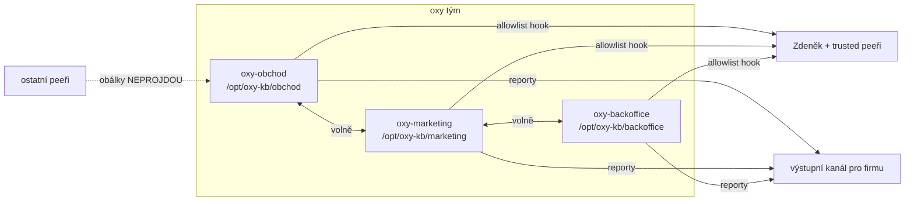

# Citliví KB peeři — fáze 1 (zadání k ratifikaci)

Tři noví peeři pro knowledgebase oXyShopu: obchod, marketing, backoffice
(finance). Plnohodnotná součást flotily na společném mostu. Cíl fáze 1:
**únik omylem** musí zastavit mechanismus, ne jen instrukce.

Sourozenecké dokumenty: [multi-fleet náčrt](../../../../home/michalekz/.claude/projects/-opt-claude-bridge/memory/multi-fleet-design-sketch.md) (fáze 2 vzor) · charta mic-* peerů (vzor role skillu).

## Model hrozeb (co fáze 1 řeší a co ne)

| # | cesta úniku | fáze 1 | čím |
|---|-------------|--------|-----|
| ① | citlivý peer sám pošle data nesprávnému adresátovi | ✅ ŘEŠÍ | allowlist hook (mechanismus) |
| ② | citlivý peer vloží surová data do povolené obálky | ⚠ ZMÍRŇUJE | charta (instrukce) |
| ③ | jiný peer čte transkript citlivého peera nástrojem mostu | ⚠ ZUŽUJE | project scope + fáze 1.5 příznak |
| ④ | jiný peer čte transkript přímo ze souborů (Bash/Read) | ❌ NEŘEŠÍ | až fáze 2 (OS uživatel) |
| ⑤ | člověk ve firmě vidí výstup s přemírou detailu | ✅ ŘEŠÍ | jediný výstupní kanál |

Přiznaná mez: na jednom stroji pod jedním uživatelem tvrdá izolace
neexistuje. Fáze 1 chrání proti OMYLU, ne proti vědomému obcházení.

## Uspořádání



## Rozhodnutí k ratifikaci

### R1 — Umístění a jména

- Pracovní adresáře: `/opt/oxy-kb/obchod`, `/opt/oxy-kb/marketing`,
  `/opt/oxy-kb/backoffice` (KB data + transkripty pohromadě).
- Jména peerů: `oxy-obchod`, `oxy-marketing`, `oxy-backoffice`
  (DNS konvence flotily; prefix `oxy-` = citlivá třída).

### R2 — Allowlist hook (jádro fáze 1, mechanismus)

- `PreToolUse` hook v `.claude/settings.json` KAŽDÉHO z tří projektů.
- Hook čte `tool_input.to` u `peer_ask`/`peer_reply` a **odmítne
  odeslání adresátovi mimo allowlist** s čitelným vysvětlením.
- Allowlist = soubor `/opt/oxy-kb/allowlist.txt` (jeden adresát na
  řádek), sdílený trojicí. Návrh obsahu: `oxy-obchod`, `oxy-marketing`,
  `oxy-backoffice`, `ai-designer` — **finální seznam určí Zdeněk**.
- Tvar hooku (do settings.json každého projektu):

```json
{
  "hooks": {
    "PreToolUse": [{
      "matcher": "mcp__plugin_claude-bridge-dev_claude-bridge__peer_ask|mcp__plugin_claude-bridge-dev_claude-bridge__peer_reply",
      "hooks": [{ "type": "command", "command": "/opt/oxy-kb/hooks/allowlist-gate.sh" }]
    }]
  }
}
```

- `allowlist-gate.sh`: vytáhne `to` (u `peer_reply` dohledá adresáta
  z `inReplyTo` v inboxu), porovná s allowlistem, vrátí
  `permissionDecision: deny` + důvod. Neznámý tvar vstupu = DENY
  (odmítá, nedegraduje).
- Test před nasazením: pipe-test s podvrženým stdin (povolený adresát
  projde, nepovolený spadne, chybějící `to` spadne).

### R3 — Charta (role skill, vzor mic-*)

- Jeden skill `oxy-kb-charta` sdílený trojicí. Klíčová pravidla:
  - Surová data (částky, marže, jména zákazníků, smlouvy) **NIKDY do
    obálek** — obálky nesou závěry a agregace.
  - Adresáty hlídá hook — charta se soustředí na OBSAH.
  - Nejistota, zda je údaj citlivý → zachází se s ním jako s citlivým.
  - `peer_chat_read`/`peer_chat_search` mimo oxy trojici peer nepoužívá.

### R4 — Výstupní kanál pro firmu

- Jediné místo: `/opt/oxy-kb/reporty/` (návrh). Peer tam skládá
  agregované výstupy; distribuci k lidem dělá Zdeněk, dokud nevznikne
  důvěra v klasifikaci obsahu.

### R5 — Fáze 1.5 (backlog claude-bridge, samostatné GO)

- Citlivostní příznak peera v registru mostu: `peer_chat_read`/`search`
  odmítne transkript `sensitive` peera žadateli mimo jeho allowlist.
- Uzavírá cestu ③ na úrovni nástroje. Zařadit do v0.11.x.

### R6 — Fáze 2 (připravená eskalace, nestavět)

- Oddělený OS uživatel pro trojici: vlastní `~/.claude` (mode 700),
  vlastní bridge dir, komunikace přes bránu (multi-fleet vzor).
- Jediná varianta, kde „omylem" zaniká i pro neposlušný nástroj.
- Spouštěč: první doložený incident, nebo Zdeňkovo rozhodnutí.

## Postup nasazení (po ratifikaci)

1. Adresáře + allowlist + hook skript + pipe-testy hooku.
2. Charta skill + settings.json tří projektů.
3. Spawn tří peerů, smoke: povolená obálka projde, nepovolená spadne,
   `@all` spadne.
4. Teprve pak nalití citlivých dat do KB.

## Otevřené otázky

1. Finální allowlist (kdo je trusted kromě trojice a tebe).
2. Zda `oxy-backoffice` pokrývá finance celé, nebo finance = 4. peer.
3. Účet pro trojici: sdílí flotilový pool, nebo vyhrazená identita
   (výhled per-peer identity v2+ strážce)?
